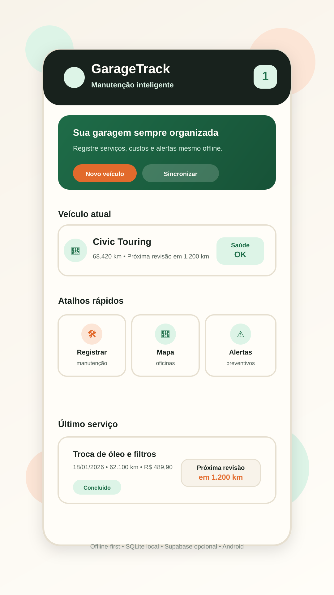

# GarageTrack

Aplicativo mobile offline-first para gestão de manutenção veicular. O GarageTrack registra histórico, custos, quilometragem, alertas preventivos, oficinas próximas e dados de veículos de forma organizada, funcionando mesmo sem internet e com sincronização opcional na nuvem.

## Tela inicial



## Sobre o projeto

O GarageTrack foi desenvolvido para motoristas e motociclistas que precisam acompanhar manutenção preventiva com mais clareza e menos dependência de anotações soltas, planilhas ou memória. O app centraliza veículos, registros de serviço, alertas e custos, com foco em uso rápido no dia a dia e confiabilidade offline.

## Tecnologias utilizadas

- Expo SDK 56
- React Native 0.85
- React 19
- TypeScript 6
- SQLite local com WAL e FTS5
- Supabase para autenticação e sincronização opcional
- expo-auth-session e expo-web-browser para login Google
- expo-location, expo-image-picker, expo-audio, expo-notifications e expo-sharing
- react-native-maps
- lucide-react-native

## Integrantes

- Integrante 1: preencher
- Integrante 2: preencher

## Funcionalidades principais

- Cadastro e gerenciamento de veículos
- Registro de manutenções com data, quilometragem, custo, peças, checklist, foto e áudio
- Histórico pesquisável de serviços
- Alertas preventivos por tempo e quilometragem
- Mapa com oficinas próximas
- Backup cifrado e exportação de dados
- Conta na nuvem opcional com login por e-mail ou Google
- Sincronização com fila e comportamento offline-first

## Estrutura resumida do repositório

- `garage-track-mobile/`: aplicativo principal
- `docs/`: documentação do projeto e materiais acadêmicos
- `supabase/`: migrações e ajustes do backend opcional
- `.github/`: automações, templates e prompts internos do repositório

## Instruções básicas de execução

```powershell
cd garage-track-mobile
npm install
npx tsc --noEmit
npm start
```

## Build Android

```powershell
cd garage-track-mobile
## Status do projeto

- [x] v1.0 — Núcleo offline (manutenções, alertas, oficinas locais)
- [x] v1.1 — Auth biométrica, backup criptografado, temas
- [x] v1.2 — Busca real de oficinas via OSM, scripts Windows
- [x] v1.3 — Conta na nuvem (Supabase) + login e-mail/senha + sync bidirecional
- [x] v1.4 — Login Google + APK público via EAS + auto-update OTA
- [ ] v2.0 — iOS, widgets Android, integração calendário

npm run build:apk
```

## Organização e segurança

- Variáveis sensíveis ficam em `garage-track-mobile/.env`, que não é versionado.
- O modelo para configurar ambiente local está em `garage-track-mobile/.env.example`.
- Artefatos gerados, como APKs e builds, são ignorados pelo Git.
- O app mantém a fonte da verdade no SQLite local e usa a nuvem apenas como sincronização opcional.

## Versionamento

- Versão atual do app: 1.5.0
- Changelog: [CHANGELOG.md](CHANGELOG.md)

<<<<<<< HEAD
- [x] v1.0 — Núcleo offline (manutenções, alertas, oficinas locais)
- [x] v1.1 — Auth biométrica, backup criptografado, temas
- [x] v1.2 — Busca real de oficinas via OSM, scripts Windows
- [x] v1.3 — Conta na nuvem (Supabase) + login e-mail/senha + sync bidirecional
- [x] v1.4 — Login Google + APK público via EAS + auto-update OTA
- [ ] v2.0 — iOS, widgets Android, integração calendário
=======
## Mais detalhes
>>>>>>> 3de6570 (docs: padronizar README e imagem inicial do projeto)

Para documentação técnica mais aprofundada, consulte a pasta `docs/` e o README interno do app em `garage-track-mobile/README.md`.
