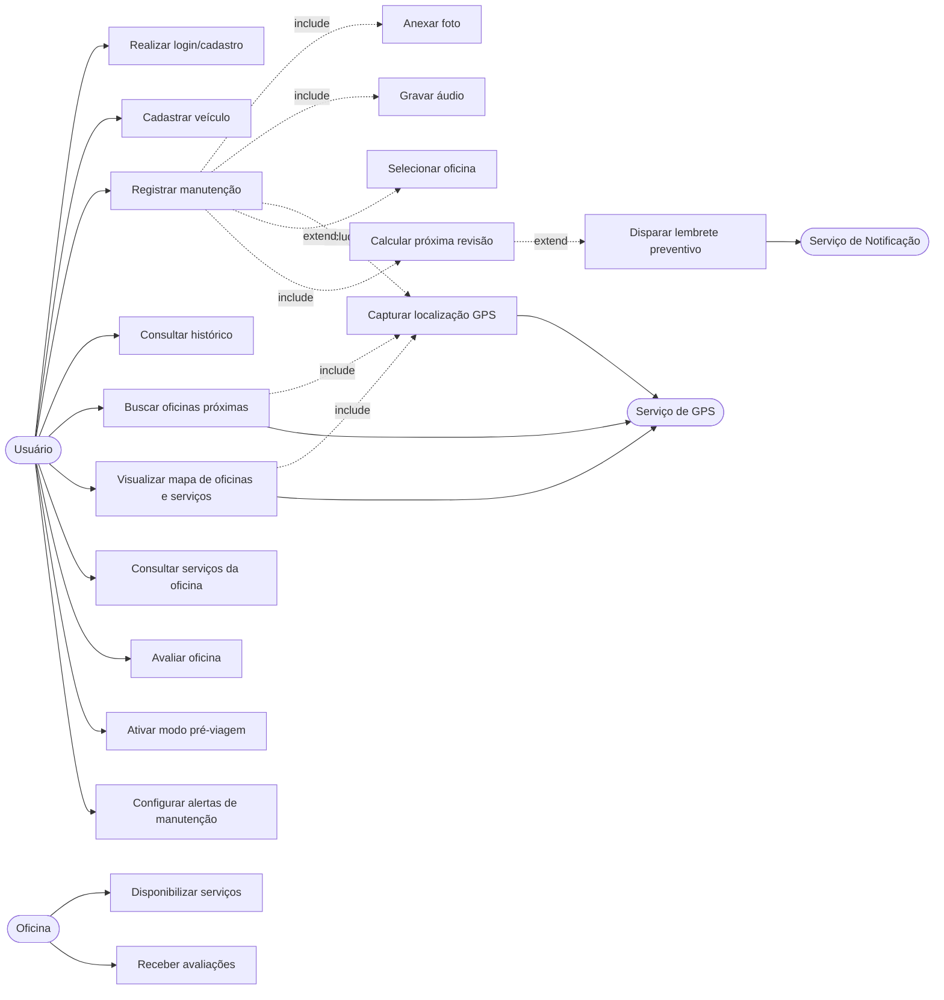
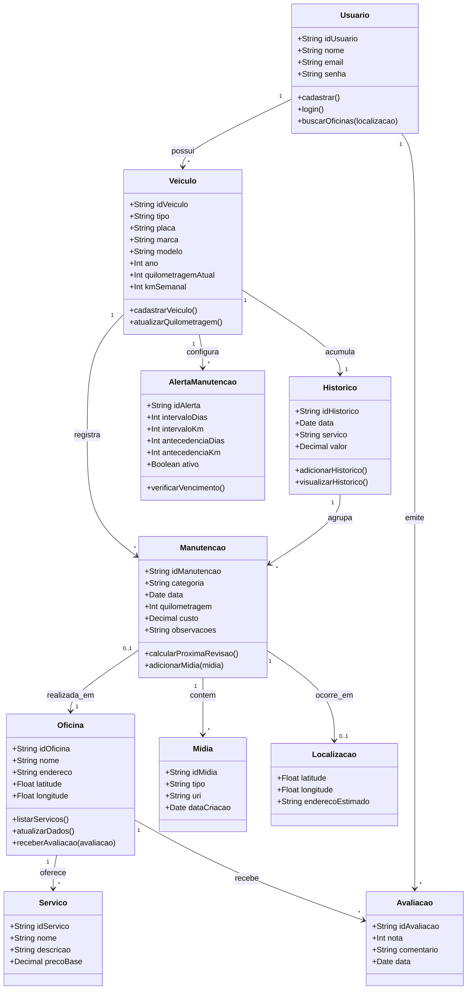
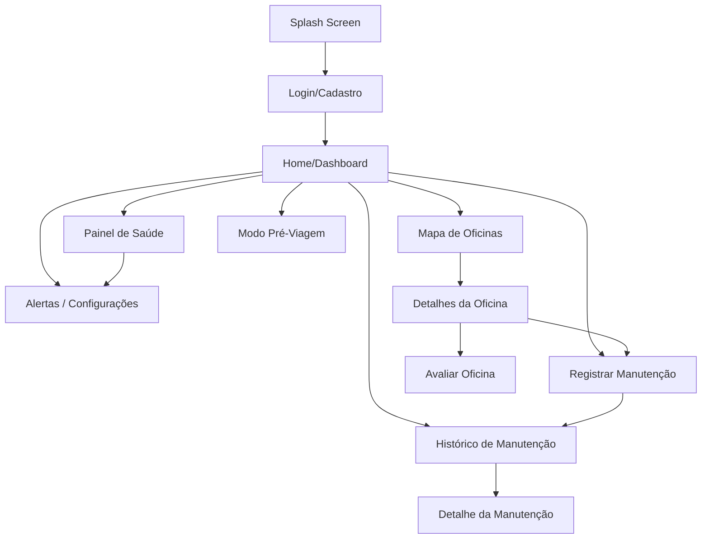

# Projeto Final — Desenvolvimento de Aplicativos para Dispositivos Móveis

## ETAPA 1 — Modelagem de Engenharia de Software

**Nome do aplicativo:** GarageTrack
**Alunos:** Lucas Vítor e George Carlos
**Contexto de aplicação:** Manutenção automotiva inteligente para carros e motos
**Tecnologias obrigatórias integradas:** Banco de Dados (SQLite), GPS (Geolocalização) e Mídia (Câmera, Galeria e Áudio)

---

## Resumo do Projeto

O GarageTrack é um aplicativo mobile voltado a motoristas e motociclistas que desejam organizar a manutenção do veículo de forma prática, segura e preventiva. O aplicativo combina banco de dados local, GPS e recursos multimídia para resolver um problema real e recorrente: a perda de histórico técnico do veículo, que gera custos evitáveis, insegurança em viagens e perda de valor na revenda.

O usuário pode cadastrar veículos, registrar manutenções com data, quilometragem, custo, oficina, foto, áudio e localização, consultar histórico filtrável, visualizar oficinas próximas em um mapa, avaliar oficinas e receber lembretes preventivos. O sistema calcula a próxima revisão pelo critério que vencer primeiro entre tempo e quilometragem, oferecendo também um modo pré-viagem que cruza a distância planejada com o estado atual do veículo.

---

## 1. Levantamento de Requisitos

### 1.1 Requisitos Funcionais

| ID | Requisito | Prioridade |
| --- | --- | --- |
| RF01 | O sistema deve permitir cadastro e login do usuário, mantendo perfil persistente no dispositivo. | Alta |
| RF02 | O usuário deve poder cadastrar e gerenciar um ou mais veículos (carro ou moto) com placa, marca, modelo, ano e quilometragem atual. | Alta |
| RF03 | O sistema deve registrar manutenções com data, categoria, quilometragem, custo, oficina e observações técnicas. | Alta |
| RF04 | O sistema deve armazenar e exibir o histórico de manutenção por veículo, com filtro por categoria. | Alta |
| RF05 | O aplicativo deve permitir anexar fotos do veículo, peça ou problema, capturadas pela câmera ou pela galeria. | Alta |
| RF06 | O aplicativo deve permitir gravar áudio descrevendo problemas mecânicos e anexá-lo ao registro. | Alta |
| RF07 | O sistema deve registrar a localização GPS do serviço realizado e da oficina. | Alta |
| RF08 | O aplicativo deve exibir oficinas próximas e manutenções anteriores em um mapa interativo. | Alta |
| RF09 | O usuário deve poder consultar os serviços oferecidos por cada oficina. | Média |
| RF10 | O usuário deve poder avaliar oficinas com nota e comentário. | Média |
| RF11 | O sistema deve calcular a próxima revisão por tempo, por quilometragem ou pelo critério que vencer primeiro. | Alta |
| RF12 | O sistema deve enviar lembretes de manutenção preventiva por meio de notificações locais. | Alta |
| RF13 | O aplicativo deve oferecer um modo pré-viagem que avalia o risco em função da distância planejada. | Média |
| RF14 | O usuário deve poder configurar intervalos e antecedência de alerta por categoria e por veículo. | Média |

### 1.2 Requisitos Não Funcionais

| ID | Categoria | Requisito | Critério de aceitação |
| --- | --- | --- | --- |
| RNF01 | Usabilidade | A interface deve ser intuitiva e seguir um padrão visual consistente. | Fluxos principais acessíveis em até três toques a partir da Home. |
| RNF02 | Desempenho | As consultas ao histórico e a abertura do dashboard devem ocorrer rapidamente. | Tempo de resposta inferior a 2 segundos para conjuntos de até 1.000 registros. |
| RNF03 | Disponibilidade | Os fluxos principais devem funcionar offline. | Registrar manutenção, consultar histórico e ver saúde funcionam sem internet. |
| RNF04 | Portabilidade | O aplicativo deve funcionar em dispositivos Android. | Executar em Android 10 ou superior, em dispositivo físico ou emulador. |
| RNF05 | Segurança | Os dados do usuário devem ser armazenados de forma segura. | Dados sensíveis não são impressos em logs e ficam restritos ao banco local. |
| RNF06 | Atualização | A localização deve refletir a posição atual do usuário ao buscar oficinas. | Captura de GPS é feita sob demanda no momento do registro ou da busca. |
| RNF07 | Acessibilidade | O status do veículo deve ser representado por texto, além de cor. | Cada categoria exibe rótulo OK/Atenção/Vencido independente da cor. |
| RNF08 | Manutenibilidade | As regras de negócio devem ficar separadas da interface. | Cálculos podem ser testados sem montar telas. |

---

## 2. Diagrama de Casos de Uso

### 2.1 Atores

- **Usuário (Motorista/Motociclista):** ator principal que interage com o aplicativo para gerenciar veículos, registrar manutenções e consultar histórico.
- **Oficina:** ator secundário que disponibiliza serviços e recebe avaliações dentro do sistema.
- **Serviço de Localização (GPS):** ator de sistema que fornece coordenadas geográficas.
- **Serviço de Notificação:** ator de sistema que entrega lembretes locais.

### 2.2 Diagrama

### 2.3 Detalhamento dos Casos de Uso Principais

#### UC03 — Registrar manutenção

- **Ator principal:** Usuário.
- **Pré-condições:** Existe um veículo cadastrado.
- **Fluxo principal:** seleciona veículo, escolhe categoria, preenche data, quilometragem, custo, observações; opcionalmente seleciona oficina; anexa foto, áudio e localização; salva o registro.
- **Inclui (include):** UC11 Anexar foto, UC12 Gravar áudio, UC13 Capturar GPS, UC15 Calcular próxima revisão.
- **Estende (extend):** UC14 Selecionar oficina (opcional).
- **Fluxo alternativo:** registro salvo sem mídia ou sem oficina.
- **Exceção:** quilometragem inválida ou custo negativo bloqueiam o salvamento.
- **Pós-condições:** histórico e painel de saúde são atualizados.

#### UC05 — Buscar oficinas próximas

- **Ator principal:** Usuário.
- **Pré-condições:** permissão de localização concedida.
- **Fluxo principal:** abre tela de mapa, sistema obtém GPS atual, lista e plota oficinas próximas.
- **Inclui (include):** UC13 Capturar GPS.
- **Exceção:** sem permissão, exibe lista textual com oficinas cadastradas.

#### UC09 — Ativar modo pré-viagem

- **Ator principal:** Usuário.
- **Fluxo principal:** informa a distância prevista; o sistema cruza com os vencimentos por data e quilometragem e indica itens OK, em atenção ou vencidos.
- **Inclui (include):** UC15 Calcular próxima revisão.

#### UC15 — Calcular próxima revisão

- **Ator principal:** Sistema.
- **Fluxo principal:** para cada categoria, recupera o último registro, aplica intervalo em dias e em km, estima vencimento e define status.
- **Estende (extend):** UC16 Disparar lembrete preventivo, quando dentro da antecedência configurada.

---

## 3. Diagrama de Classes

### 3.1 Diagrama

### 3.2 Descrição das Classes

- **Usuario:** representa o motorista/motociclista, dono dos veículos e autor das manutenções e avaliações.
- **Veiculo:** carro ou moto cadastrado, com quilometragem atual e uso semanal.
- **Manutencao:** registro técnico de um serviço realizado, com mídia e localização opcionais.
- **Oficina:** estabelecimento de serviço com endereço, coordenadas e serviços oferecidos.
- **Servico:** serviço específico que uma oficina pode oferecer.
- **Historico:** agregação dos registros de manutenção de um veículo, usada para consultas e relatórios.
- **Avaliacao:** nota e comentário do usuário sobre uma oficina.
- **AlertaManutencao:** regra preventiva por categoria, com intervalos e antecedência.
- **Midia:** foto ou áudio anexado ao registro.
- **Localizacao:** par de coordenadas com endereço estimado.

### 3.3 Relacionamentos

- Associação 1..N entre Usuário e Veículo.
- Associação 1..N entre Veículo e Manutenção, Veículo e AlertaManutencao.
- Composição entre Manutenção e Mídia (a mídia só existe vinculada ao registro).
- Agregação entre Histórico e Manutenção (o histórico agrupa registros já existentes).
- Associação 0..1 entre Manutenção e Oficina (o registro pode ou não ter oficina).
- Associação 1..N entre Oficina e Serviço, Oficina e Avaliação.
- Associação 0..1 entre Manutenção e Localização.

---

## 4. Prototipagem Rápida (Figma)

**Link do protótipo no Figma:**
[CarPipos / GarageTrack — Mobile App Prototype](https://www.figma.com/make/BR0fn3tA5Y7OQ7iAdfOU8Y/CarPipos-Mobile-App-Prototype?t=nl3nWSqsjek9PmBU-0)

### 4.1 Telas-chave

| # | Tela | Objetivo | Elementos de UI |
| --- | --- | --- | --- |
| 1 | Splash Screen | Apresentar a marca e inicializar o banco local. | Logo do app, nome “GarageTrack”, subtítulo “Sua oficina no bolso”, barra de progresso. |
| 2 | Login / Cadastro | Identificar o usuário no aplicativo. | Campo e-mail, campo senha, botão “Entrar”, botão “Cadastrar”, link de recuperação. |
| 3 | Home / Dashboard | Visão geral do veículo selecionado. | Seletor de veículo, KPIs (quilometragem, total gasto, último serviço, próximo alerta), botões “Buscar Oficinas”, “Histórico” e “Meu Veículo”. |
| 4 | Mapa de Oficinas | Localizar oficinas próximas via GPS. | Mapa, marcadores das oficinas, lista lateral, botão “Ver detalhes”. |
| 5 | Detalhes da Oficina | Apresentar a oficina escolhida. | Nome, endereço, serviços disponíveis, avaliações, botão “Rota GPS”. |
| 6 | Histórico de Manutenção | Consultar serviços realizados. | Filtros por categoria, lista com data, valor e categoria, detalhe do registro. |
| 7 | Registrar Manutenção / Problema | Registrar um serviço ou reportar um problema. | Categoria, data, km, custo, oficina, checklist contextual, botões câmera, galeria, áudio e GPS, campo de notas, botão “Salvar”. |
| 8 | Painel de Saúde | Indicar o estado por categoria. | Cards por categoria com status OK/Atenção/Vencido e motivo. |
| 9 | Modo Pré-Viagem | Avaliar risco antes de viajar. | Campo de distância prevista, banner de status geral, checklist por categoria. |
| 10 | Alertas / Configurações | Ajustar regras preventivas. | Switch por categoria, controles de intervalo em dias e km, antecedência. |

### 4.2 Elementos de UI Comuns

- Botões primários com destaque visual e feedback de toque.
- Campos de texto com rótulo, dica e validação inline.
- Mapas e marcadores para localização.
- Cards informativos para KPIs e categorias.
- Ícones consistentes para categorias de manutenção.
- Reprodutor de áudio embutido para mídia anexada.
- Imagens de evidência exibidas em proporção controlada.

### 4.3 Fluxo de Navegação

### 4.4 Considerações de UX/UI

- **Consistência:** mesmo conjunto de cores, tipografia e espaçamento em todas as telas; ações primárias sempre destacadas com botão de cor sólida.
- **Acessibilidade:** rótulos textuais junto a indicadores de cor; tamanho mínimo de toque adequado; contraste alto entre texto e fundo.
- **Feedback visual:** estados de carregamento ao salvar, indicação clara de gravação de áudio, confirmação após registrar manutenção e mensagens explicativas em caso de erro de permissão.
- **Hierarquia visual:** KPIs em destaque na Home, prioridades técnicas evidenciadas no painel de saúde, modo pré-viagem com banner colorido conforme o resultado.
- **Redução de fricção:** quilometragem pré-preenchida com o valor atual do veículo, oficinas e categorias sugeridas conforme o tipo do veículo (carro ou moto).

---

## 5. Tecnologias Obrigatórias da Disciplina

| Tecnologia | Implementação no GarageTrack |
| --- | --- |
| Banco de Dados | SQLite local (via Expo SQLite) para usuários, veículos, oficinas, manutenções, mídias, avaliações, alertas e histórico. |
| GPS | Geolocalização (via Expo Location) para registrar o local do serviço, buscar oficinas próximas e plotar marcadores no mapa. |
| Mídia | Câmera e galeria (via Expo Image Picker) para fotos do veículo/problema e gravação de áudio (via Expo Audio) para descrição mecânica. |

---

## 6. Formato de Trabalho e Entrega

- **Modalidade:** projeto desenvolvido em dupla (Lucas Vítor e George Carlos).
- **Documento:** este arquivo contempla as quatro seções de modelagem exigidas no PDF da disciplina — Requisitos, Casos de Uso, Classes e Prototipagem Rápida.
- **Protótipos:** disponíveis no Figma, com telas-chave e indicação do fluxo de navegação entre elas.
- **Próxima etapa:** implementação do MVP em React Native (Expo), com banco SQLite, GPS, câmera, áudio e notificações locais já cobertos no escopo definido.
